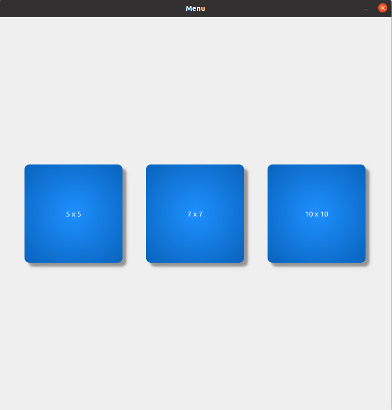
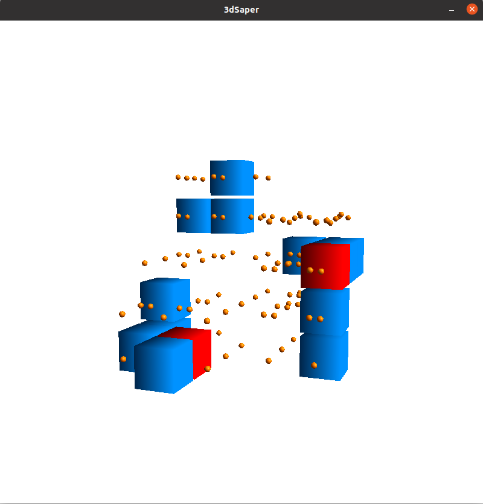
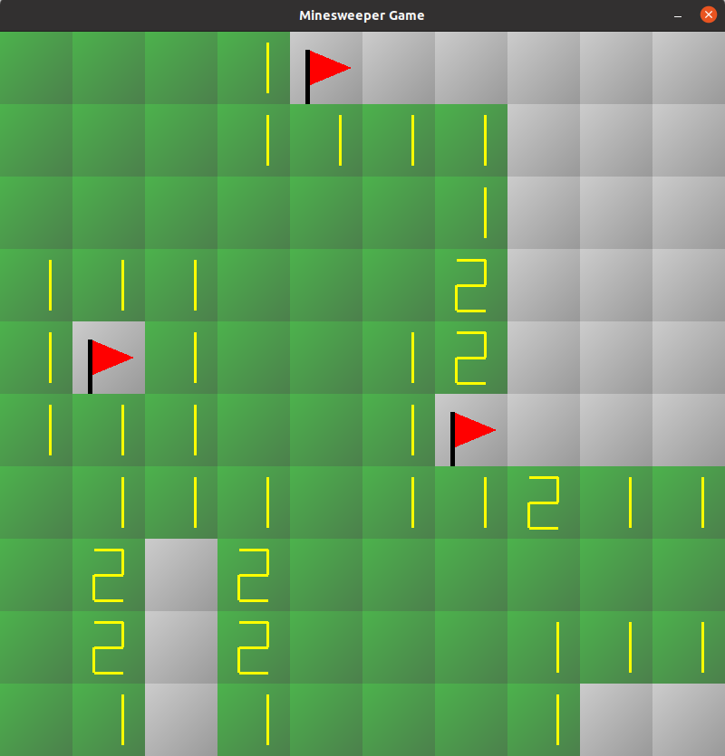
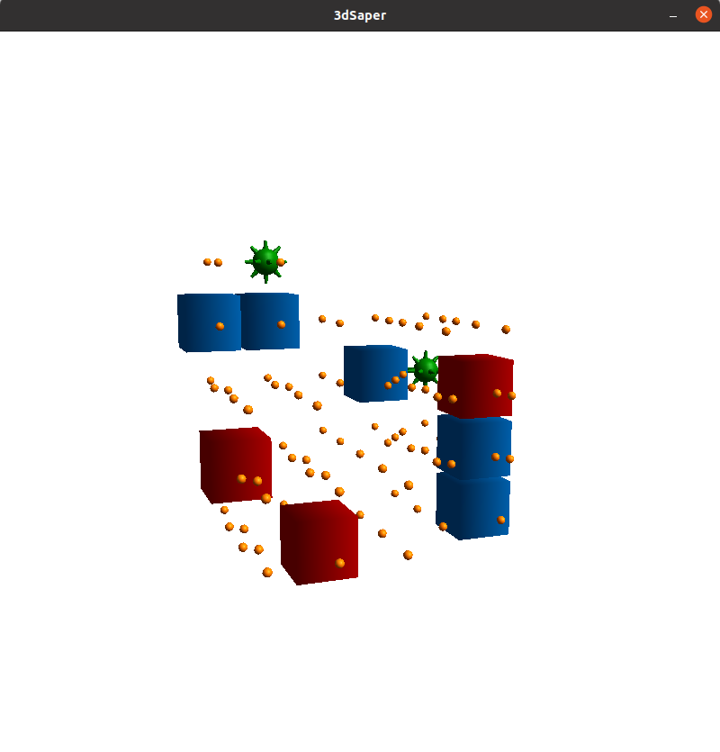

# 3DSaperQtOpengl

Проект представляет собой компьютерную версию классической игры "Сапёр" в 3D формате и с авторскими механиками. Игроку предоставляется трехмерное игровое поле, разделенное на кубы. Некоторые из клеток содержат мины, а задача игрока - открыть все клетки, не содержащие мины, и отметить те клетки, где мины находятся.

Основные особенности проекта:

- 3D Геймплей: В отличие от традиционных 2D версий сапера, 3D-Сапер предоставляет игрокам возможность исследовать игровое поле в трех измерениях.

- Двухмерный режим: Игроку предоставляется возможность продолжить игру при нажатии на мину, для этого ему необходимо выиграть в 2D версии игры.

- Обезвреживание мины: При обезвреживания мины посредством победы в 2D версии игры происходит перерасчет соседних клеток с цифрами.

- Разнообразие уровней сложности: 3 уровня сложности: 5x5x5 с 8 минами в 3D режиме и 10 в 2D, 7x7x7 c 24 мины в 3D режиме и 15 в 2D, 10x10x10 c 80 минами в 3D режиме и 20 в 2D, 2D режим играется на поле 10x10.
  
- Интуитивный интерфейс: Интуитивный интерфейс позволит поиграть в игру каждому.

- Обновление дизайна цифр: В режиме 3D теперь применяются сферические элементы, вдохновленные маркировкой игральных кубиков, вместо стандартных цифровых обозначений.

- Управление: Вращение вокруг центра игрового поля происходит на зажатия левой или правой кнопки мыши и перемещением ее. Приближение и отдаление - колесиком мыши.

Выбор режима:

Процесс игры:

Обезвреживание мин:

Обезвреженные мины:

